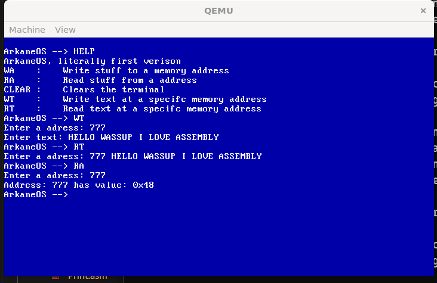

# ArkaneOS
A very "unique" and small operating system working only in kernel mode with a wierd way of handling memory.

## Tools used
- Programming language: Assembly
- Makefile
- GDB (debug)

## Features
The features aren't that much yet, you got a simple terminal which is in kernel mode and you are able to..

- Manipulate memory adresses
    - Writing text to a specifc memory adress
    - Aswell as reading that text
- Terminal
    - Help
    - Clear
- Keyboard input

## Technical info

- 64 BIT
- Qeemu for the .bin file
- No paging (I want to kind of implement a way for the user to work high level with numbers instead of hex numbers for memory adresses (to achieve that im probably gonna create my own small language) , also i want to implement a whole "new" memory manager without paging)
- The entire OS is ram based, no acess to disk

Here is a image of the current state

Side not: H is 0x48 in hexadecimal (based of ASCII)
